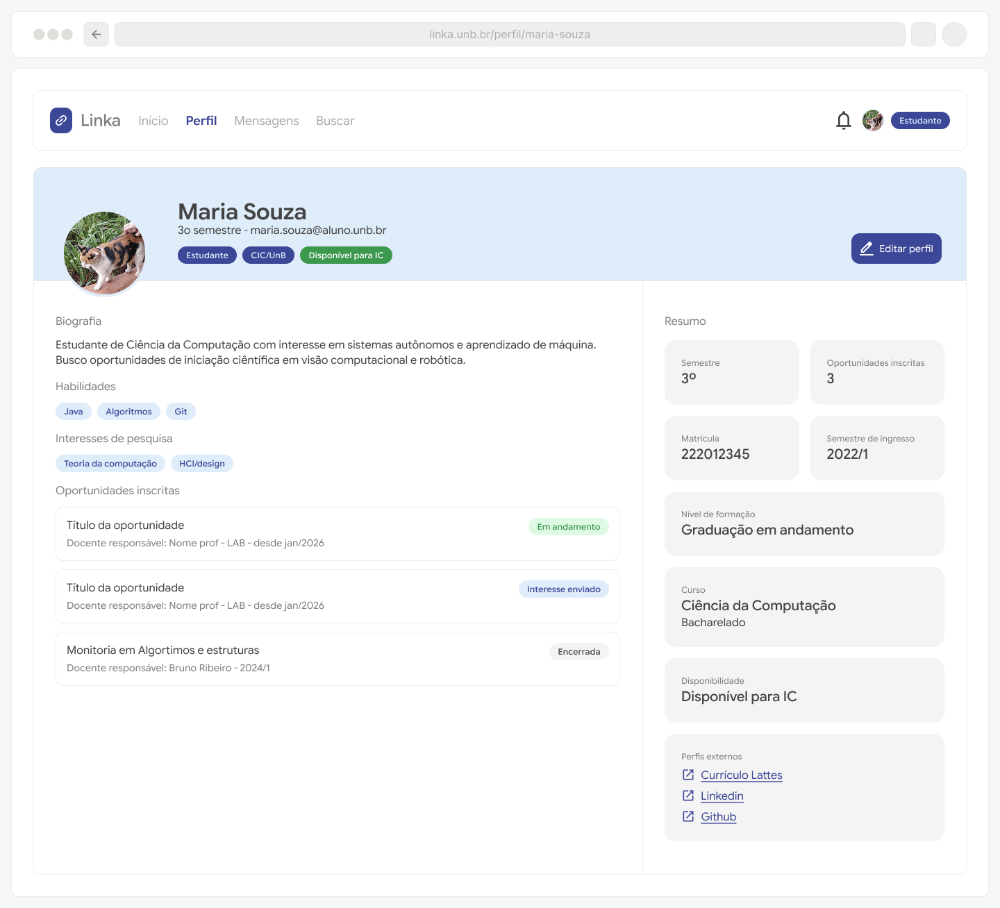
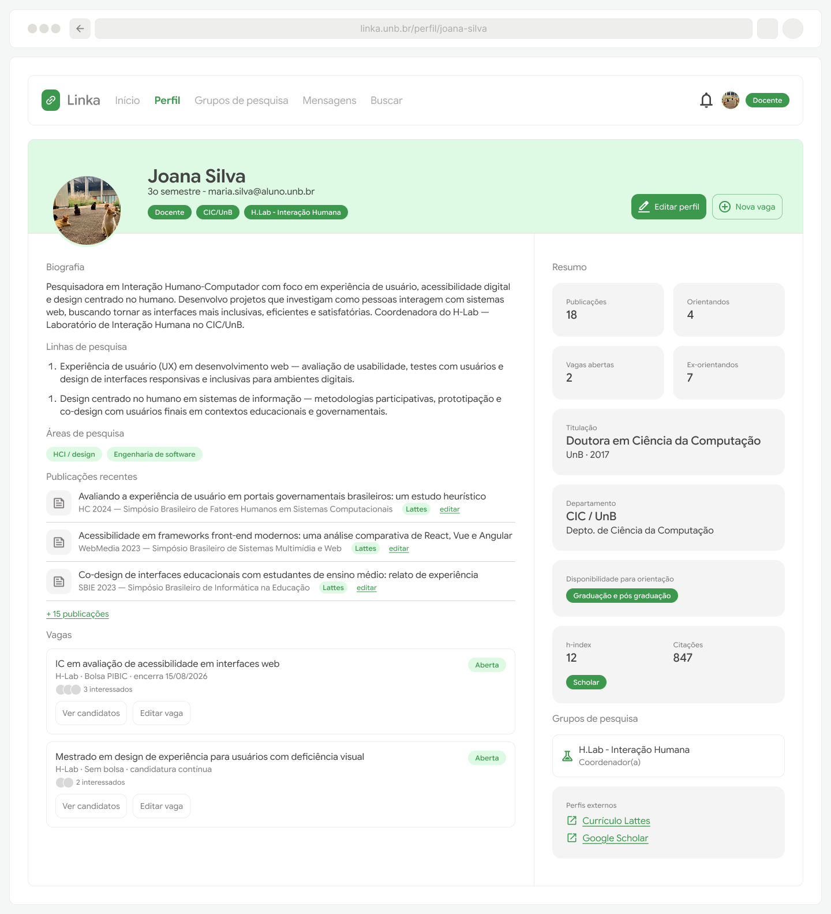
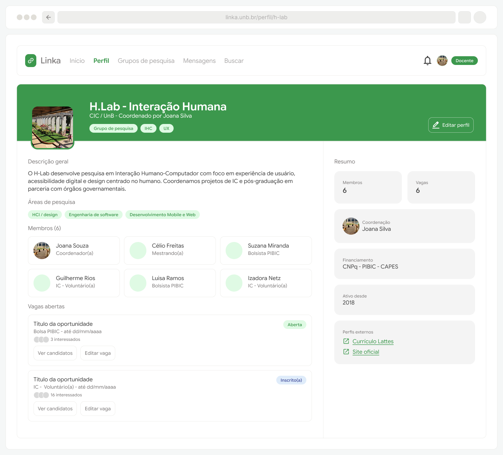

# Protótipos para o Épico 1: Perfis

Considerando que o Épico 1 contempla os requisitos funcionais RF01 a RF05 e RNF1 e RNF3, os protótipos criados focaram na estruturação das páginas de perfil com suas respectivas opções de edição e visualização. Também há opcionais de interações a partir do perfil que variam conforme o papel que os visualiza (por exemplo: um aluno ao visualizar o perfil de um professor terá opções de contato ou demonstrar interesse em uma vaga, enquanto que o professor que visualiza seu próprio perfil visualiza ações de edição)

A versão principal do protótipo, para fins de visualização, foi construída para web/desktop, porém a proposta é de um layout responsivo e adaptável a dispositivos móveis.

[Perfil estudante: protótipo navegável](https://www.figma.com/proto/hjdInaixuSTPC1rqKgWsKU/Linka?page-id=0%3A1&node-id=47-1031&viewport=100%2C567%2C0.49&t=XQGKSJVHmNfB8ONt-1&scaling=min-zoom&content-scaling=fixed&starting-point-node-id=47%3A1031)

--------------

[Perfil docente: protótipo navegável](https://www.figma.com/proto/hjdInaixuSTPC1rqKgWsKU/Linka?page-id=0%3A1&node-id=47-1905&viewport=100%2C567%2C0.49&t=XQGKSJVHmNfB8ONt-1&scaling=min-zoom&content-scaling=fixed&starting-point-node-id=47%3A1905)

--------------

[Perfil grupo de pesquisa: protótipo navegável](https://www.figma.com/proto/hjdInaixuSTPC1rqKgWsKU/Linka?page-id=0%3A1&node-id=47-2474&viewport=100%2C567%2C0.49&t=XQGKSJVHmNfB8ONt-1&scaling=min-zoom&content-scaling=fixed&starting-point-node-id=47%3A1905)

