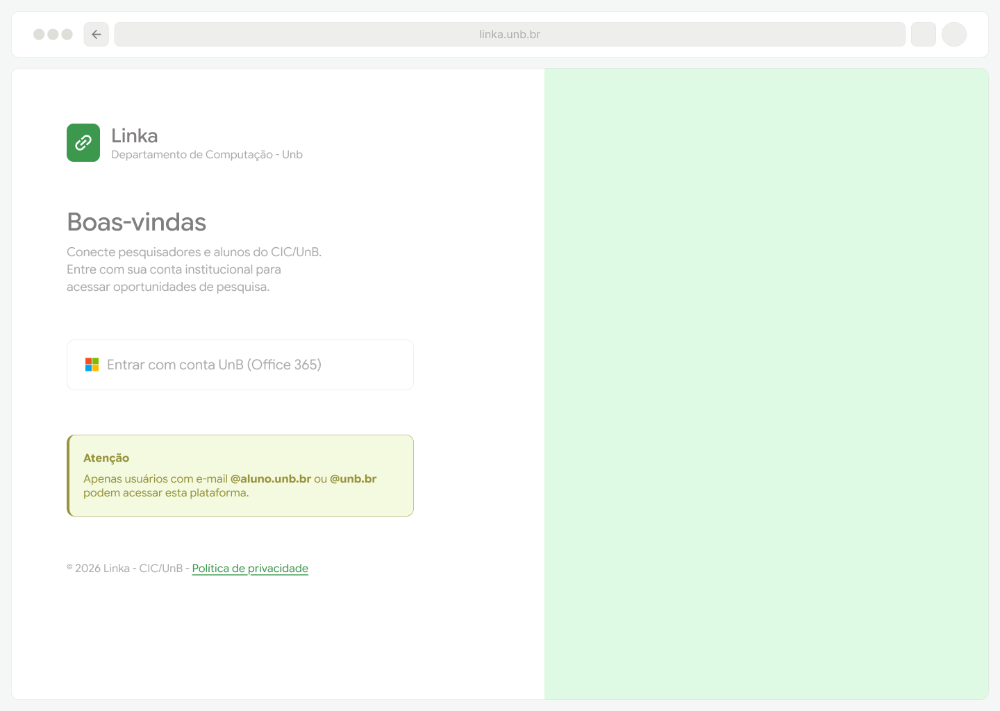
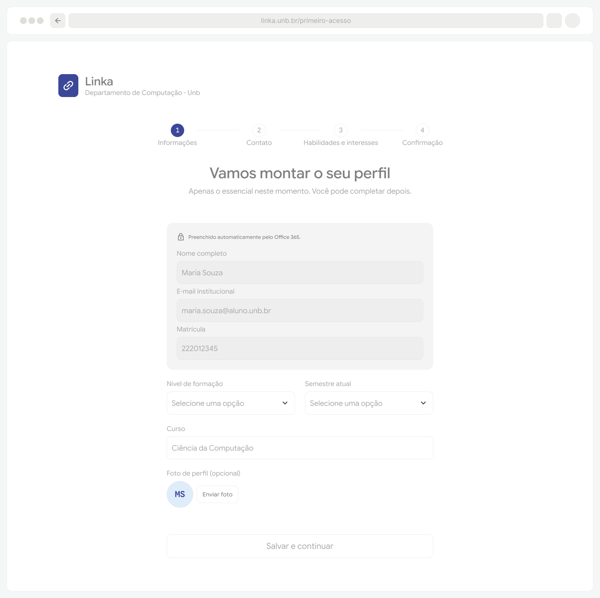
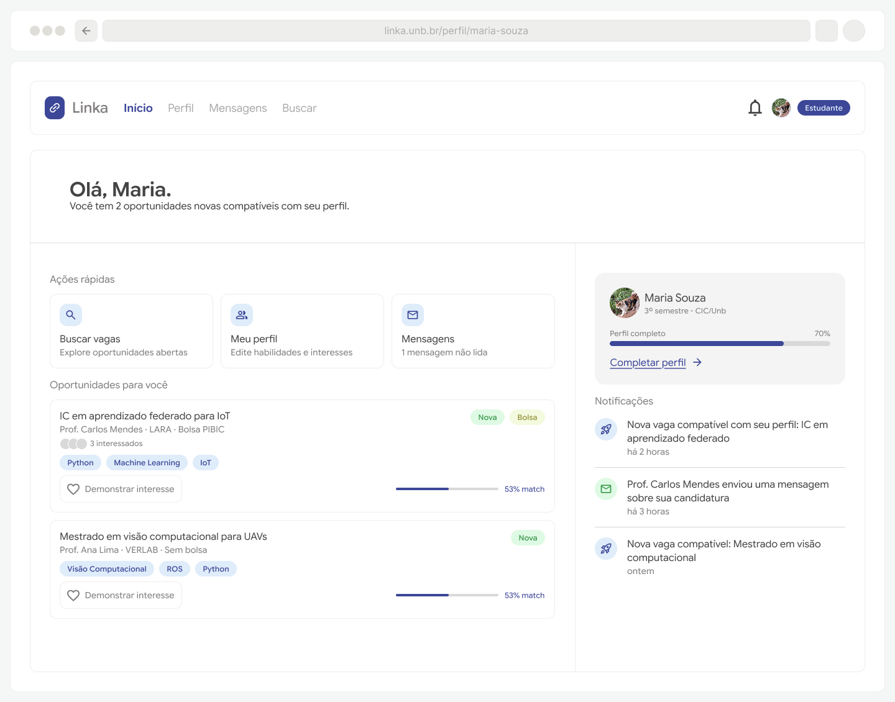
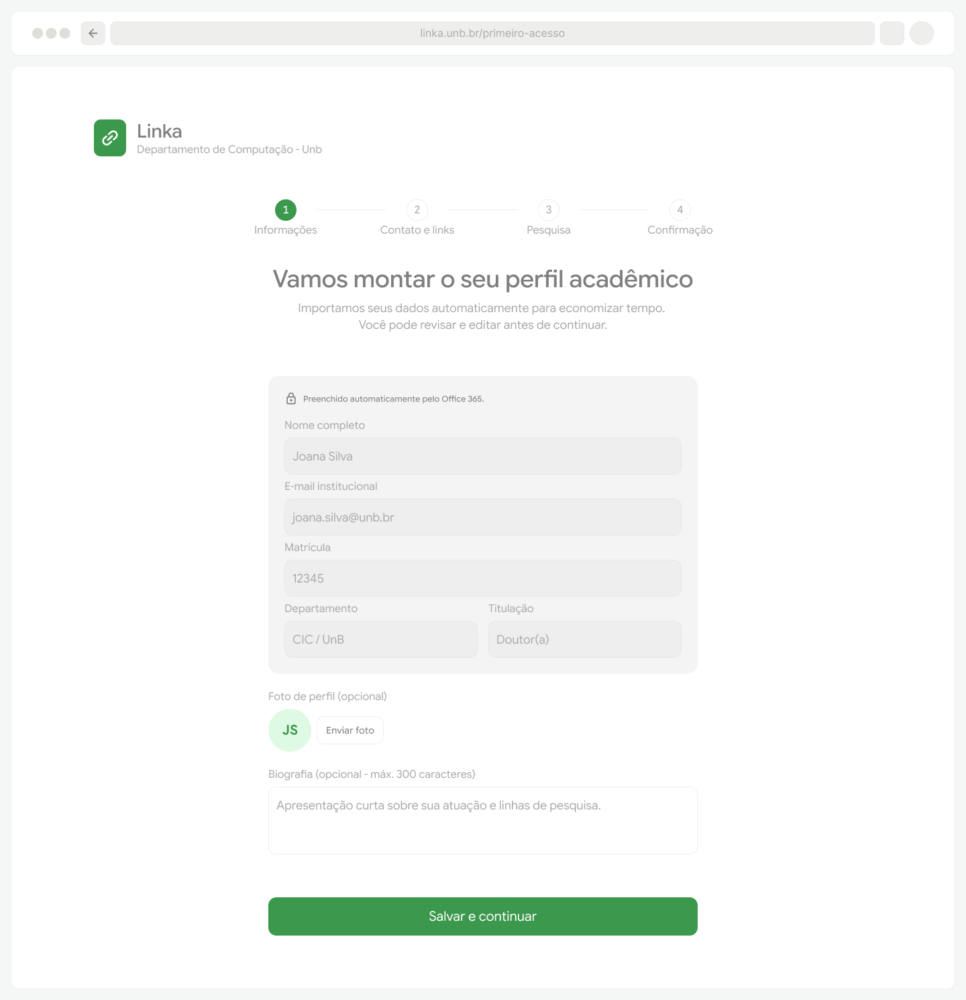
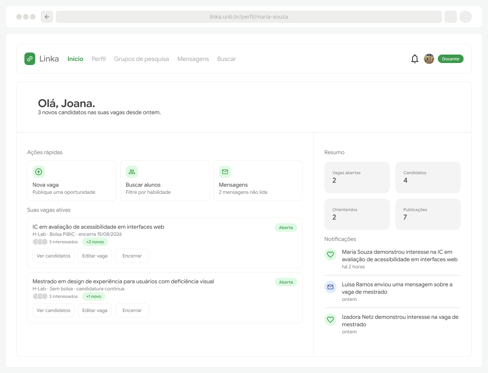
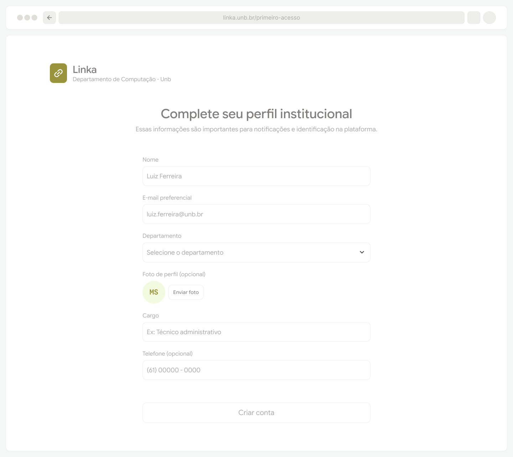
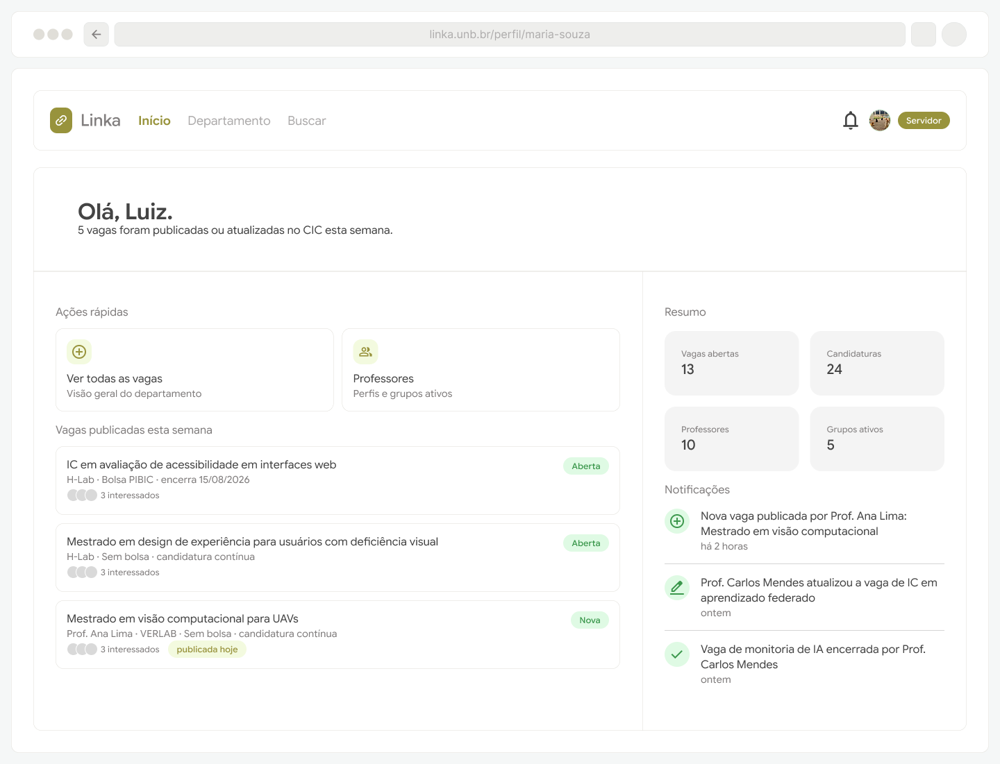

# Protótipos para o Épico 2: Autenticação

Considerando que o Épico 1 contempla os requisitos funcionais RF06 a RF08 e RNF3, os protótipos criados estruturam os fluxos de login, contemplando os cenários de primeiro acesso e acesso de uma conta já cadastrada, bem como as especificidades dessas jornadas para cada papel.

Ao realizar o primeiro acesso, o domínio do e-mail já funcionará como parâmetro para o redirecionamento mais adequado de fluxo. O usuário com e-mail `@aluno.unb.br` já é redirecionado para o onboarding de estudante enquanto que os usuários com e-mail `@unb.br` selecionam seu tipo de vínculo para o redirecionamento adequado de onboarding.

## Estudante

[Primeiro acesso](https://www.figma.com/proto/hjdInaixuSTPC1rqKgWsKU/Linka?page-id=0%3A1&node-id=45-1442&viewport=100%2C567%2C0.49&t=XQGKSJVHmNfB8ONt-1&scaling=min-zoom&content-scaling=fixed&starting-point-node-id=45%3A1442)

--------------

[Login e página inicial](https://www.figma.com/proto/hjdInaixuSTPC1rqKgWsKU/Linka?page-id=0%3A1&node-id=83-8240&viewport=100%2C567%2C0.49&t=XQGKSJVHmNfB8ONt-1&scaling=min-zoom&content-scaling=fixed&starting-point-node-id=83%3A8240&show-proto-sidebar=1)

## Docente

[Primeiro acesso](https://www.figma.com/proto/hjdInaixuSTPC1rqKgWsKU/Linka?page-id=0%3A1&node-id=10-2&viewport=100%2C567%2C0.49&t=XQGKSJVHmNfB8ONt-1&scaling=min-zoom&content-scaling=fixed&starting-point-node-id=10%3A2&show-proto-sidebar=1)

--------------

[Login e página inicial](https://www.figma.com/proto/hjdInaixuSTPC1rqKgWsKU/Linka?page-id=0%3A1&node-id=83-8797&viewport=100%2C567%2C0.49&t=XQGKSJVHmNfB8ONt-1&scaling=min-zoom&content-scaling=fixed&starting-point-node-id=83%3A8797&show-proto-sidebar=1)

## Servidor

[Primeiro acesso](https://www.figma.com/proto/hjdInaixuSTPC1rqKgWsKU/Linka?page-id=0%3A1&node-id=10-2&viewport=100%2C567%2C0.49&t=XQGKSJVHmNfB8ONt-1&scaling=min-zoom&content-scaling=fixed&starting-point-node-id=10%3A2&show-proto-sidebar=1)

--------------

[Login e página inicial](https://www.figma.com/proto/hjdInaixuSTPC1rqKgWsKU/Linka?page-id=0%3A1&node-id=83-8852&viewport=100%2C567%2C0.49&t=XQGKSJVHmNfB8ONt-1&scaling=min-zoom&content-scaling=fixed&starting-point-node-id=83%3A8852&show-proto-sidebar=1)

