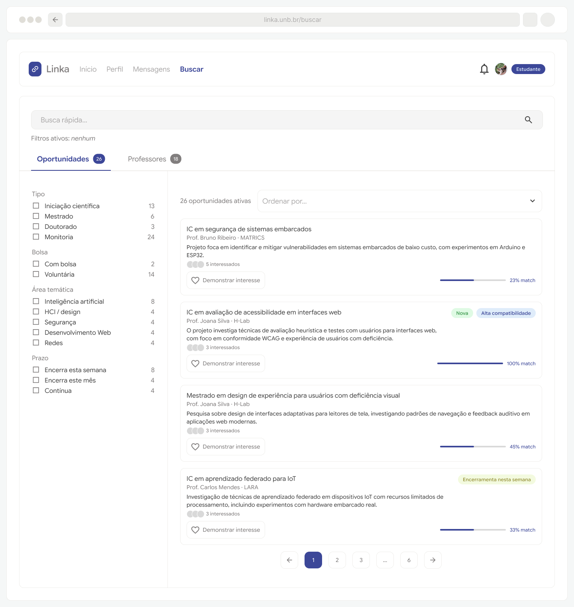
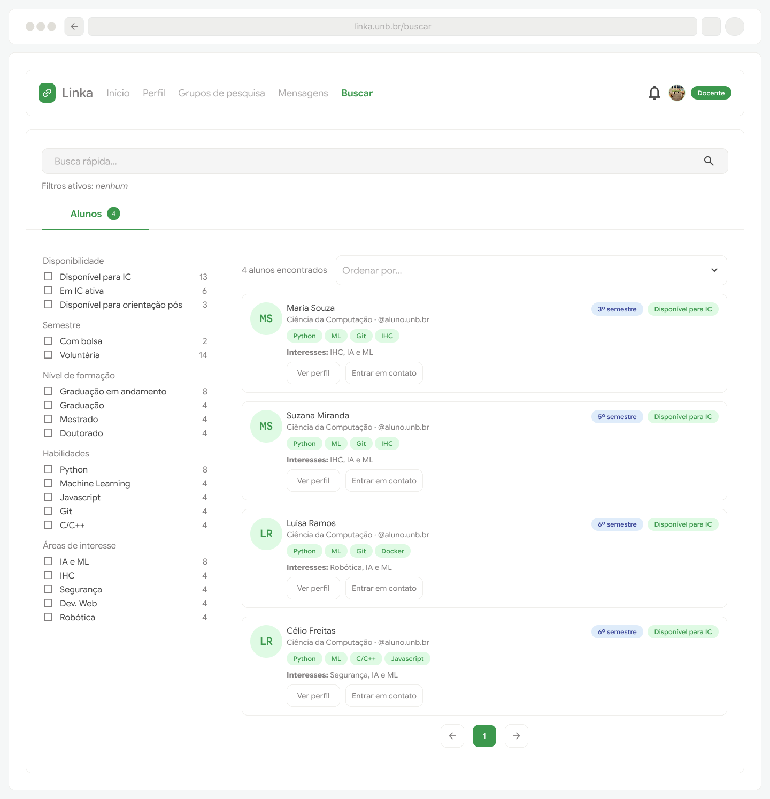

# Protótipos para o Épico 3: Busca e descoberta

O Épico 3 contempla os requisitos R09 a RF11 de forma que é preciso que a ferramenta apresente buscas específicas para os perfis de alunos e professores com os filtros adequados.

## Estudante

[Busca de estudante por tema e/ou professor](https://www.figma.com/proto/hjdInaixuSTPC1rqKgWsKU/Linka?page-id=0%3A1&node-id=47-3859&viewport=100%2C567%2C0.49&t=XQGKSJVHmNfB8ONt-1&scaling=scale-down&content-scaling=fixed&starting-point-node-id=47%3A3729&show-proto-sidebar=1)

## Docente

[Busca de docente por um aluno com perfil específico]()

