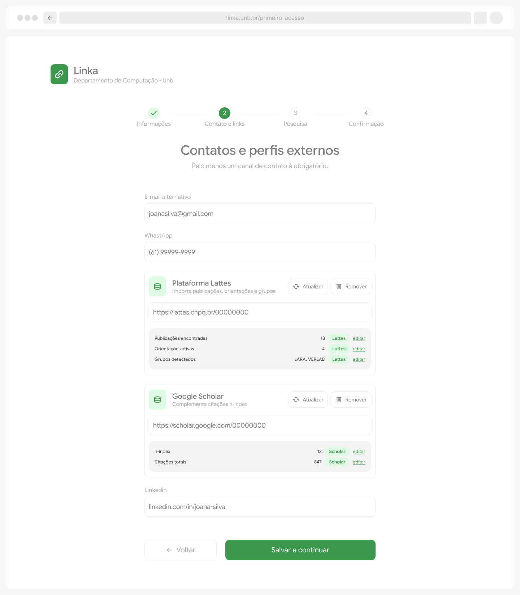
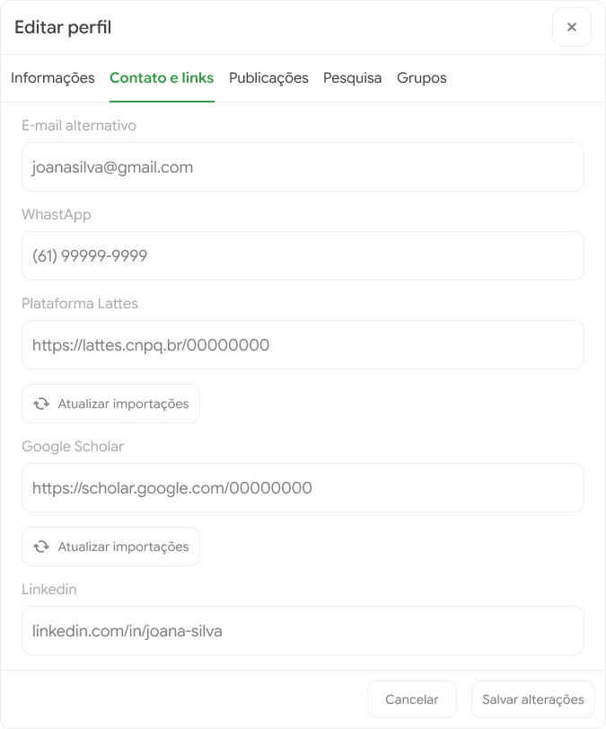
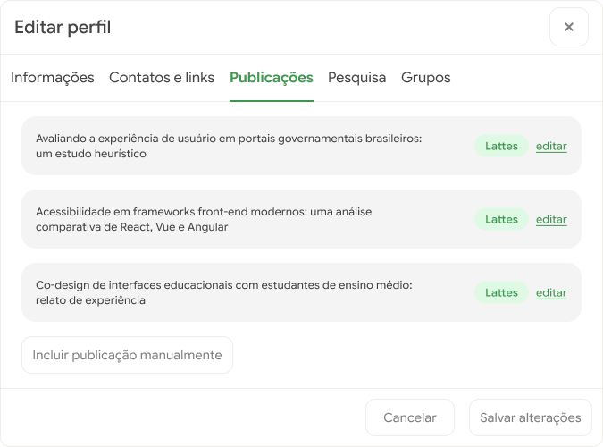

# Protótipos para o Épico 4: Ingestão de dados

O épico 4 está relacionado com a importação de informações de plataformas acadêmicas como Lattes e Google Scholar. Os requisitos RF12 a RF1F14 estão contemplados nas interfaces em diferentes momentos como no onboarding de um docente, na edição e visualização de seu perfil.

## Onboarding docente

## Editar perfil

## Editar publicações

