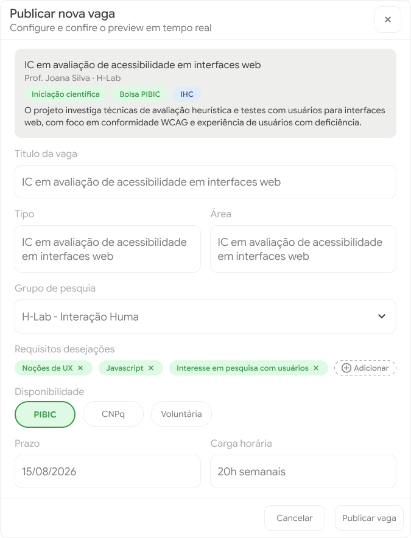
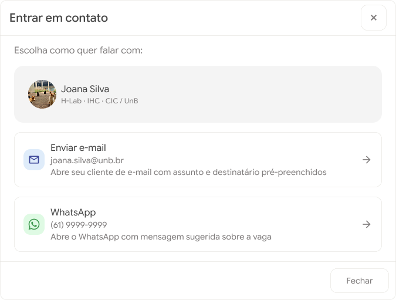
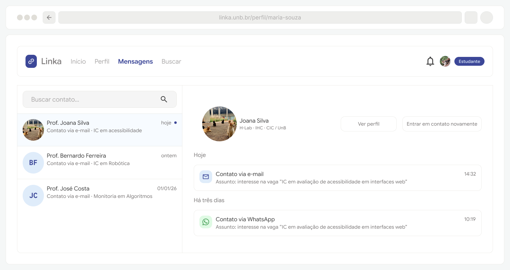
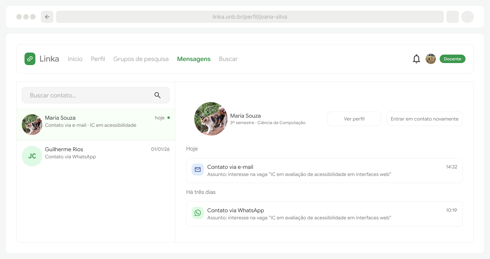

# Protótipos para o Épico 5: Oportunidades e interação

O quinto épico concentra os requisitos relacionados as dinâmicas de interação entre os usuários da plataforma, contemplando os requisitos RF15 a RF18. Há uma aba dedicada de mensagens, mas requisitos como RF15 e R16 estão contemplados nas opções de interface dos perfis de alunos e professores com botões de acesso rápido para ou criar uma nova vaga, no caso de um professor, ou entrar em contato, para ambos os perfis. As principais notificações de contato e novidades com relação a vagas também são apresentadas aos usuários em suas páginas iniciais, como está registrado no descrito do protótipo do épico 2.

## Criação de vagas

## Contato 

### Registro de mensagens entre estudantes e docentes

[Protótipo navegável](https://www.figma.com/proto/hjdInaixuSTPC1rqKgWsKU/Linka?page-id=0%3A1&node-id=112-6816&viewport=100%2C567%2C0.49&t=XQGKSJVHmNfB8ONt-1&scaling=scale-down&content-scaling=fixed&starting-point-node-id=112%3A6816&show-proto-sidebar=1)

-------------

[Protótipo navegável](https://www.figma.com/proto/hjdInaixuSTPC1rqKgWsKU/Linka?page-id=0%3A1&node-id=112-6829&viewport=100%2C567%2C0.49&t=XQGKSJVHmNfB8ONt-1&scaling=scale-down&content-scaling=fixed&starting-point-node-id=112%3A6829&show-proto-sidebar=1)

