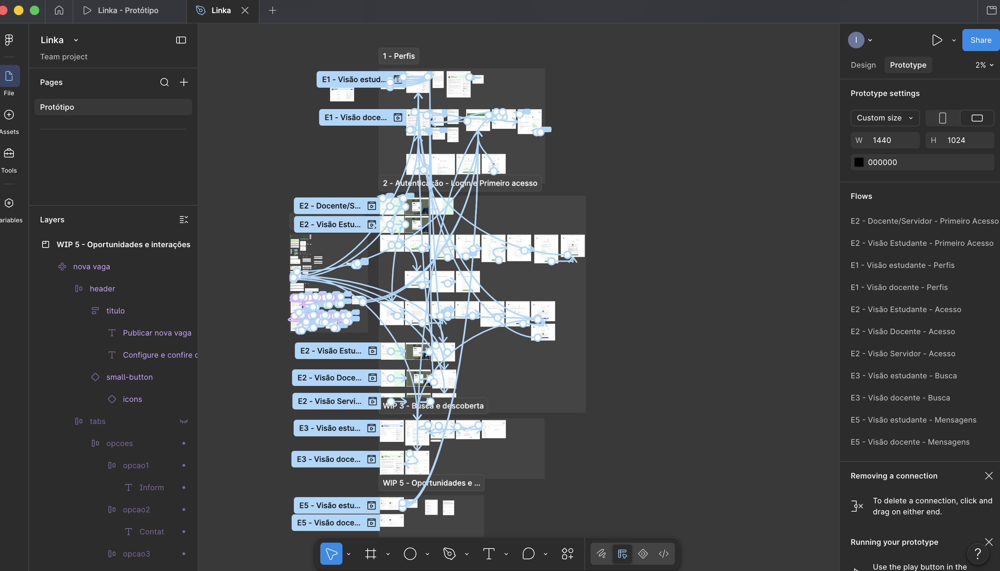

# Protótipos

Os fluxos dos protótipos foram organizados por épico, contemplando os requisitos delimitados e as descrições e cenários estipulados nas respectivas histórias de usuário que constam nesta documentação.

Com relação a estratégia visual, considerando que a natureza da plataforma já demanda uma quantidade maior de informações, sobretudo textuais como dados dos usuários, descrições de oportunidades e publicações, optou-se pela utilização de elementos visuais pontualmente aplicados e uma interface com cores neutras e menos saturadas. Assim, buscou-se mitigar a possível sobrecarga de informação e cognitiva dos usuários ao utilizar a plataforma. A escolha de cores também busca ficar alinhada à identidade visual da universidade (azul e verde) e sinalizar o tipo de perfil de acesso predominando o azul para estudantes, verde para docentes e amarelo para servidores.

[Link para protótipo no figma](https://www.figma.com/design/hjdInaixuSTPC1rqKgWsKU/Linka?node-id=0-1&t=J3hGm5rl52uWMxoT-1)

